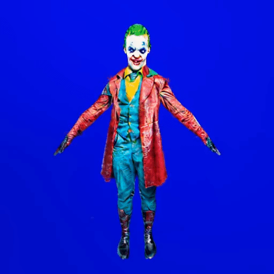

<div align="center">

# DreamAvatar: Text-and-Shape Guided 3D Human Avatar Generation via Diffusion Models
  
<a href="https://yukangcao.github.io/">Yukang Cao</a><sup>\*</sup>,
<a href="https://yanpei.me/">Yan-Pei Cao</a><sup>\*</sup>,
<a href="https://www.kaihan.org/">Kai Han</a><sup>†</sup>,
<a href="https://scholar.google.com/citations?user=4oXBp9UAAAAJ&hl=zh-CN">Ying Shan</a>,
<a href="https://i.cs.hku.hk/~kykwong/">Kwan-Yee K. Wong</a><sup>†</sup>


[](https://arxiv.org/abs/2304.00916)
<a href="https://yukangcao.github.io/DreamAvatar/"></a>




  
Please refer to our webpage for more visualizations.
</div>

## Abstract
We present **DreamAvatar**, a text-and-shape guided framework for generating high-quality 3D human avatars with controllable poses. While encouraging results have been reported by recent methods on text-guided 3D common object generation, generating high-quality human avatars remains an open challenge due to the complexity of the human body's shape, pose, and appearance. We propose DreamAvatar to tackle this challenge, which utilizes a trainable NeRF for predicting density and color for 3D points and pretrained text-to-image diffusion models for providing 2D self-supervision. Specifically, we leverage the SMPL model to provide shape and pose guidance for the generation. We introduce a dual-observation-space design that involves the joint optimization of a canonical space and a posed space that are related by a learnable deformation field. This facilitates the generation of more complete textures and geometry faithful to the target pose. We also jointly optimize the losses computed from the full body and from the zoomed-in 3D head to alleviate the common multi-face ''Janus'' problem and improve facial details in the generated avatars. Extensive evaluations demonstrate that DreamAvatar significantly outperforms existing methods, establishing a new state-of-the-art for text-and-shape guided 3D human avatar generation.

<div align="center">

</div>

## Installation

See [installation.md](docs/installation.md) for additional information, including installation via Docker.

The following steps have been tested on Ubuntu20.04.

- You must have an NVIDIA graphics card with at least 48GB VRAM and have [CUDA](https://developer.nvidia.com/cuda-downloads) installed.
- Install `Python >= 3.8`.
- (Optional, Recommended) Create a virtual environment:

```sh
python3 -m virtualenv venv
. venv/bin/activate

# Newer pip versions, e.g. pip-23.x, can be much faster than old versions, e.g. pip-20.x.
# For instance, it caches the wheels of git packages to avoid unnecessarily rebuilding them later.
python3 -m pip install --upgrade pip
```

- Install `PyTorch >= 1.12`. We have tested on `torch1.12.1+cu113` and `torch2.0.0+cu118`, but other versions should also work fine.

```sh
# torch1.12.1+cu113
pip install torch==1.12.1+cu113 torchvision==0.13.1+cu113 --extra-index-url https://download.pytorch.org/whl/cu113
# or torch2.0.0+cu118
pip install torch torchvision --index-url https://download.pytorch.org/whl/cu118
```

- Install [pytorch3d](https://github.com/facebookresearch/pytorch3d/blob/main/INSTALL.md) and [kaolin](https://kaolin.readthedocs.io/en/latest/notes/installation.html).

```
pip install git+https://github.com/facebookresearch/pytorch3d.git@v0.7.1
pip install git+https://github.com/NVIDIAGameWorks/kaolin.git
```

- (Optional, Recommended) Install ninja to speed up the compilation of CUDA extensions:

```sh
pip install ninja
```

- Install dependencies:

```sh
pip install -r requirements.txt
```

## Download SMPL-X model

* Please kindly follow instructions in [SMPL-X](https://smpl-x.is.tue.mpg.de/) to download required model.
```
./smpl_data
├── SMPLX_NEUTRAL.pkl
├── SMPLX_FEMALE.pkl
├── SMPLX_MALE.pkl
```

## Training canonical DreamAvatar

```sh
# avatar generation with 512x512 NeRF rendering, ~48GB VRAM
python launch.py --config configs/dreamavatar.yaml --train --gpu 0 system.prompt_processor.prompt="Wonder Woman"
# if you don't have enough VRAM, try training with 64x64 NeRF rendering
python launch.py --config configs/dreamavatar.yaml --train --gpu 0 system.prompt_processor.prompt="Wonder Woman" data.width=64 data.height=64 data.batch_size=1
```

### Resume from checkpoints

If you want to resume from a checkpoint, do:

```sh
# resume training from the last checkpoint, you may replace last.ckpt with any other checkpoints
python launch.py --config path/to/trial/dir/configs/parsed.yaml --train --gpu 0 resume=path/to/trial/dir/ckpts/last.ckpt
# if the training has completed, you can still continue training for a longer time by setting trainer.max_steps
python launch.py --config path/to/trial/dir/configs/parsed.yaml --train --gpu 0 resume=path/to/trial/dir/ckpts/last.ckpt trainer.max_steps=20000
# you can also perform testing using resumed checkpoints
python launch.py --config path/to/trial/dir/configs/parsed.yaml --test --gpu 0 resume=path/to/trial/dir/ckpts/last.ckpt
# note that the above commands use parsed configuration files from previous trials
# which will continue using the same trial directory
# if you want to save to a new trial directory, replace parsed.yaml with raw.yaml in the command

# only load weights from saved checkpoint but dont resume training (i.e. dont load optimizer state):
python launch.py --config path/to/trial/dir/configs/parsed.yaml --train --gpu 0 system.weights=path/to/trial/dir/ckpts/last.ckpt
```

## Bibtex.
If you want to cite our work, please use the following bib entry:
```
@inproceedings{cao2024dreamavatar,
  title={Dreamavatar: Text-and-shape guided 3d human avatar generation via diffusion models},
  author={Cao, Yukang and Cao, Yan-Pei and Han, Kai and Shan, Ying and Wong, Kwan-Yee~K.},
  booktitle={Proceedings of the IEEE/CVF Conference on Computer Vision and Pattern Recognition},
  pages={958--968},
  year={2024}
}
```

## Acknowledgement
Thanks to the brilliant works from [Threestudio](https://github.com/threestudio-project/threestudio) and [Stable-DreamFusion](https://github.com/ashawkey/stable-dreamfusion)
